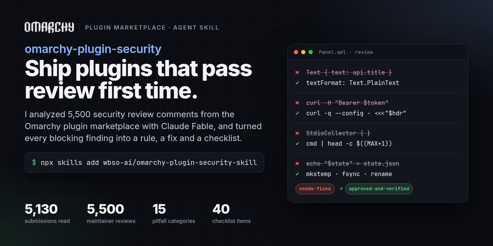
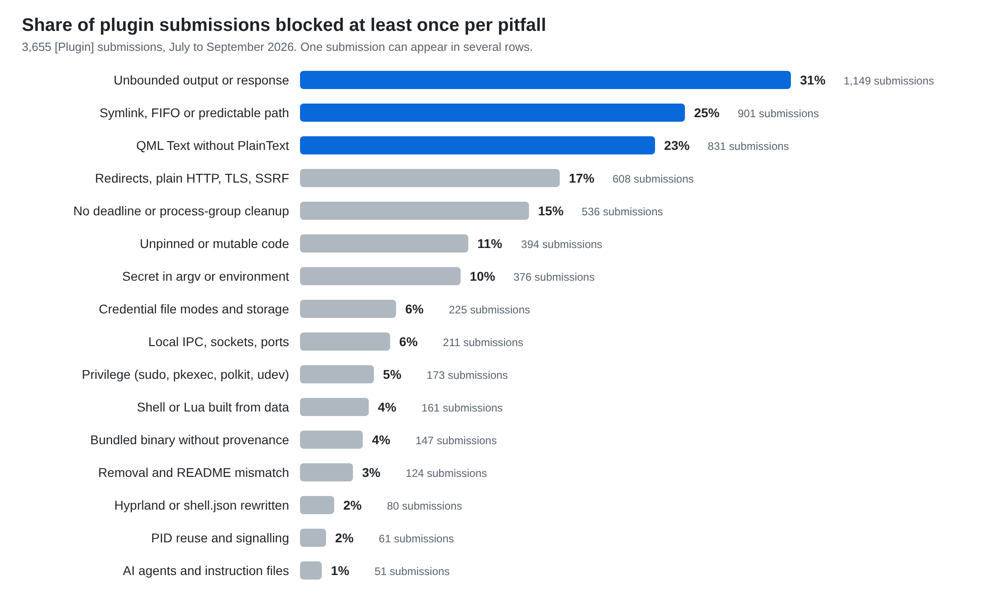
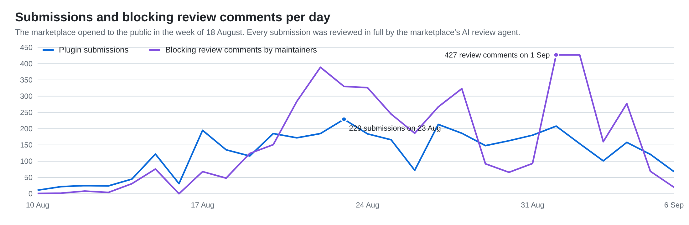
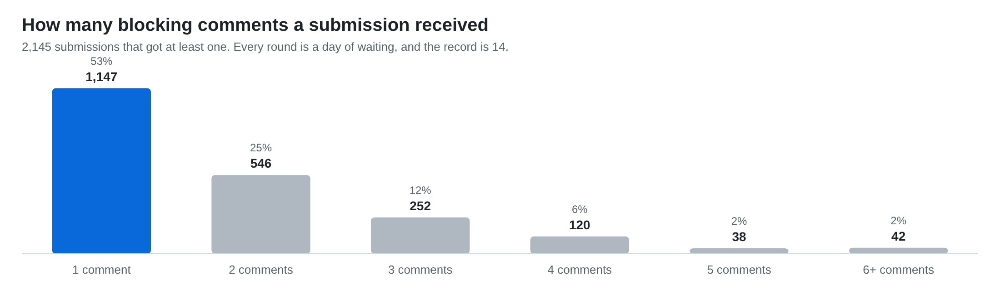

# omarchy-plugin-security-skill



An agent skill that keeps your [Omarchy](https://omarchy.org) plugin from getting `needs-fixes` on the [plugin marketplace](https://github.com/omacom/omarchy-plugin-marketplace).

**The guide itself is [`SKILL.md`](SKILL.md).** Read it there; this README only explains what it is and how to install it.

I analyzed all 5,130 submission issues in the marketplace repository and the roughly 5,500 comments the security maintainers left on them between July and September 2026 with Claude Fable, and turned every blocking finding into a rule, the exact fix reviewers ask for, and a checklist. It is written for coding agents (Claude Code, Codex, Cursor, OpenCode and anything else that reads `SKILL.md` files), but it is just as readable as a field guide for humans.

## By the numbers

Six weeks of marketplace history, read end to end.

| | |
|---|---|
| **3,655** plugin submissions from **2,060** authors | plus 1,386 update and verification tickets |
| **5,475** review comments from the maintainer accounts | 3.3 MB of review text, median comment 511 characters |
| **51%** of submissions got at least one security finding | and 59% of the plugins that are listed today were blocked first |
| **0.2 days** to listing when clean, **1.0 day** when blocked | every review round costs about a day |
| **70** submissions blocked by the static baseline scanner | **2,145** blocked by the review agent |

That last row is the reason this skill exists. The static baseline catches `curl | sh`, unpinned git clones and dangerous sudoers rules. Everything else in the chart below was found by the marketplace's review agent, an AI reviewer run by the maintainer that reads the full tree at the exact commit and writes up each finding with file, line and the required fix. So this is an agent skill distilled from an agent's reviews, which is also why the fix wording is so consistent.

<picture>
  <source media="(prefers-color-scheme: dark)" srcset="assets/chart-pitfalls-dark.png">
  
</picture>

Three pitfalls each hit one in four submissions, and none of them is exotic: a `Text` element without `textFormat: Text.PlainText`, a `StdioCollector` that buffers a helper's output before any byte cap, and a state file written through a predictable path. The skill spends most of its length on exactly these.

<picture>
  <source media="(prefers-color-scheme: dark)" srcset="assets/chart-weekly-dark.png">
  
</picture>

<picture>
  <source media="(prefers-color-scheme: dark)" srcset="assets/chart-rounds-dark.png">
  
</picture>

### What surprised me

- **The review agent reads everything.** Every push gets a full re-review of the whole tree, not just the cited line, so a second round routinely surfaces findings the first one did not mention. The skill tells you to harden the whole tree before the first submission.
- **"Fixed" is often "moved".** A byte cap applied after the data is in memory, a `mktemp` whose descriptor is closed before the rename, a secret moved from argv into the environment: all re-blocked with the phrase "the boundary moved rather than closed".
- **A README claim is a finding.** "No network access", "keyring only", "never edits `~/.config/hypr`": when the code disagrees, the sentence itself blocks the listing.
- **`/proc/<pid>/cmdline` is world-readable.** 376 submissions put a token in a curl argument. The reviewers' line: "that is the difference between a secret and a value anyone on the system can read".
- **A window title is attacker-controlled.** Any web page sets `document.title`, Qt's `AutoText` promotes markup to rich text, and rich text loads `` from inside the shell process. That single mechanism accounts for 831 blocked submissions.
- **Policy moved mid-stream.** On 4 September the review narrowed to a security-only threat model, and many same-user availability issues became hardening rather than blockers. The skill marks those, and still recommends the fixes, because the reviewers still ask for them.

## What is in [SKILL.md](SKILL.md)

- The [reviewers' threat model](SKILL.md#the-reviewers-threat-model-in-five-sentences) in five sentences.
- A [grep audit](SKILL.md#grep-audit-before-you-submit) that runs in seconds and points at every place a reviewer will look.
- Fifteen categories of pitfalls with the number of review comments raising each one, the mechanism, and the required fix in the maintainers' own idioms: files and state, secrets, bounds, QML rendering sinks, command construction, network and TLS, supply chain, privilege, processes and PIDs, Hyprland and shared configuration, local IPC, privacy and README claims, AI agents, removal, repository hygiene.
- How the [automated security baseline](SKILL.md#the-automated-baseline) works and how to run it locally.
- [Submission mechanics](SKILL.md#submission-mechanics-that-cost-people-days): exact-SHA binding, how to trigger re-validation, labels, `manual-setup`, the seven-day rule, Verify tickets.
- A [40-point pre-submission checklist](SKILL.md#pre-submission-checklist).
- [Helper code reviewers have accepted](SKILL.md#appendix-helpers-reviewers-have-accepted): a descriptor-bound state-file helper in Python, a bounded supervised command and a pinned fetch in bash, a `SplitParser` pattern in QML, signalling by process identity.

## Install

With the [skills CLI](https://skills.sh), which installs into Claude Code, Codex, Cursor, OpenCode, Copilot and 70 other agents:

```bash
npx skills add wbso-ai/omarchy-plugin-security-skill
```

Add `-a claude-code` or `-a codex` to target one agent, or `--list` to see what it would install. Update later with `npx skills update`.

Without the CLI, the skill is one file, `SKILL.md`. Put it in a directory named `omarchy-plugin-security` inside your agent's skills folder:

```bash
git clone https://github.com/wbso-ai/omarchy-plugin-security-skill ~/.claude/skills/omarchy-plugin-security   # Claude Code
git clone https://github.com/wbso-ai/omarchy-plugin-security-skill ~/.agents/skills/omarchy-plugin-security   # Codex and the ~/.agents convention
```

## Use

The skill triggers on its own when you ask an agent to build, audit or harden an Omarchy plugin, or when you paste a marketplace review. You can also invoke it directly, for example `/omarchy-plugin-security` in Claude Code, with a request such as "audit this plugin before I submit it" or "here is the maintainer's finding, fix it across the tree".

Without an agent, open [`SKILL.md`](SKILL.md), run the grep audit and read the checklist, and run the local baseline scan described under "The automated baseline".

## Scope and caveats

The marketplace review is a static, exact-commit review, and so is this guide. It reflects what maintainers flagged up to 6 September 2026, including the policy narrowing on 4 September 2026 that reclassified pure same-user availability issues as hardening rather than blockers. Policies move; when in doubt, the marketplace's `SECURITY.md`, `SUBMISSION.md` and `VERIFICATION.md` are authoritative.

Following this guide does not make a plugin secure, and passing marketplace review is not a security audit. It makes the plugin pass the review that exists.

## License

MIT. The quoted review comments are from public GitHub issues in the marketplace repository.

## How this was made

All 5,130 issues and their comments were fetched through the GitHub GraphQL API, the maintainers' comments were classified as finding, approval or process note, and the 4,500 finding-type comments were aggregated into pitfalls with the exact fix wording, using Claude Fable. The counts in the chart are submissions whose review comments match each pitfall's vocabulary, so treat them as close rather than exact; one submission usually appears in several rows.

The charts in `assets/` are plain SVG rendered with headless Chromium in a light and a dark variant. The social image is rendered from `assets/social.html` the same way:

```bash
chromium --headless=new --window-size=1280,640 --screenshot=assets/social.png assets/social.html
```
